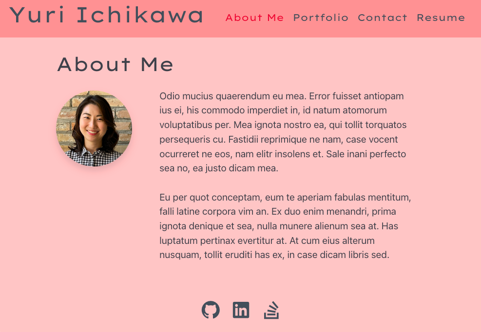
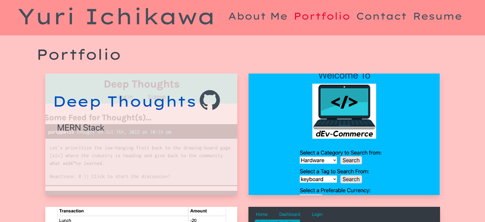

# Yurippe's Portfolio

## Description
This website showcase about myself and my coding skills using `React` and built with single-page application and responsive design. Check it out to see what I can do 😎 ✨

## Table of Contents
- [Website](#website)
- [Usage](#usage)
- [License](#license)
- [Questions](#questions)

## Website
https://stormy-beach-09172.herokuapp.com/

## Usage
1. `About Me` section: 
    - Short biography about myself
2. `Portfolio` section:
    - List of my featured projects. 
    - **Hover** the picture and **Click** its title to see the application. 
    - **Hover** the picture and **Click** its github icon to see the repository
  
3. `Contact` section:
    - Enter your name, email address, and message to send me message. Be sure to fill all fields and valid email address to send message.
4. `Resume` section:
    - Download my resume by clicking `resume` link
    - My proficiencies on front-end and back-end listed
5. Footer links:
    - Links to my GitHub profile, LinkedIn, and Stack Overflow are provided

## License
Licensed under the [MIT License](https://opensource.org/licenses/MIT).
      

## Questions
- GitHub Profile: https://github.com/YuriI92
- If you have any additional questions, please feel free to contact me by email.
  E-mail Address: <yurichikawa1992@gmail.com>
      
  